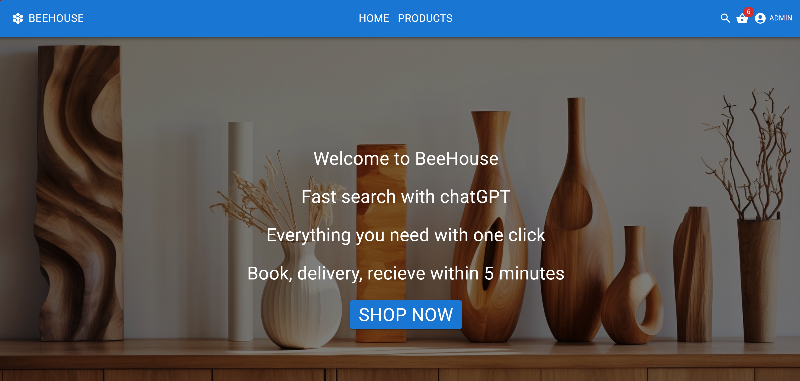
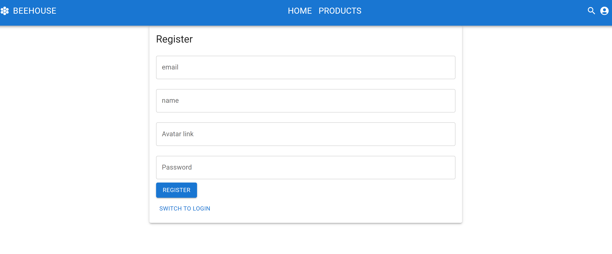
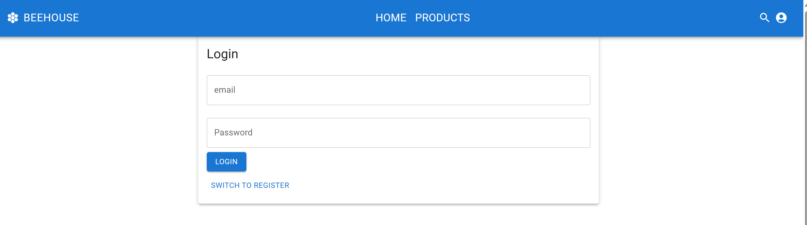
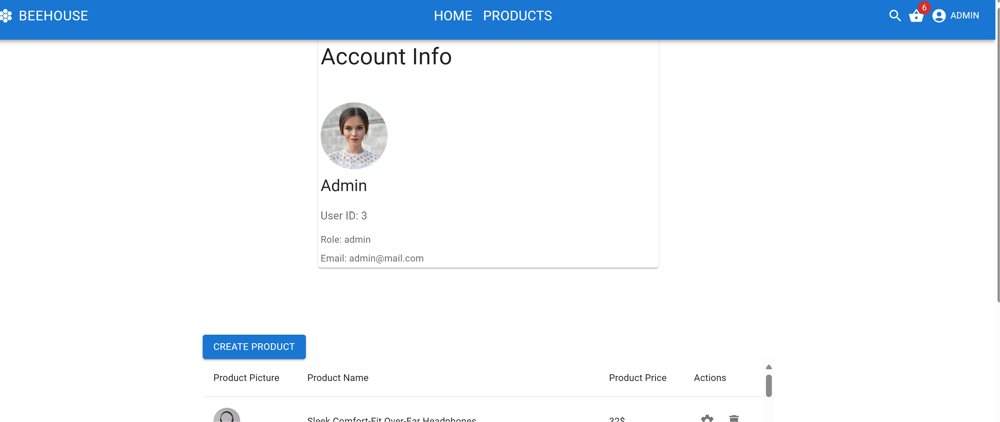
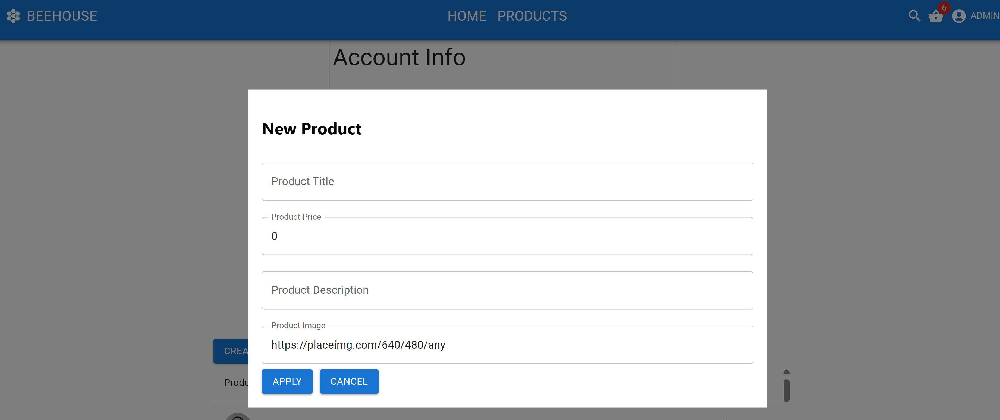
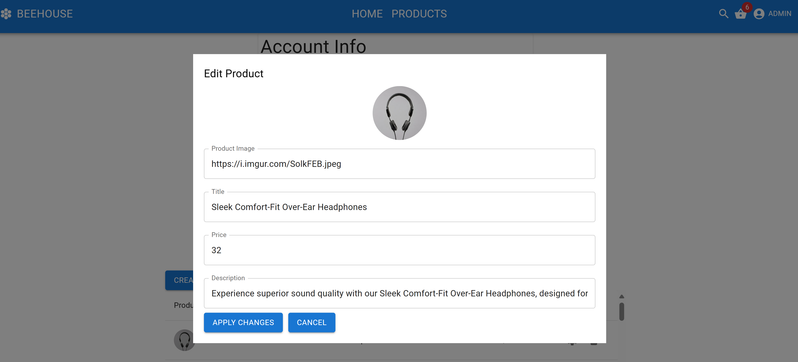
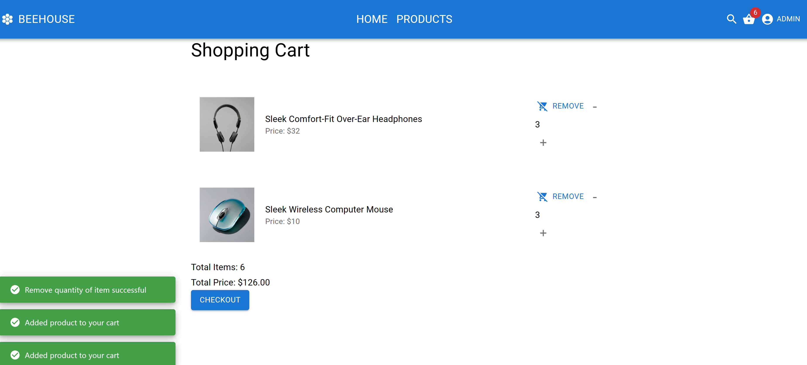

<p align="center">
  
</p>
<p align="center">
    <h1 align="center">fs17-Frontend-project E-Commerce Project</h1>
</p>
<p align="center"> <em>Developed with the software and tools below.</em>
</p>
<p align="center">


</p>

# Frontend project

This project is developed using ReactJS, TypeScript, React Router Dom, Redux Toolkit, Material UI, and SASS, following a structured architecture that includes components, hooks, screens, and unit testing. The main purpose of this project is to create an e-commerce website where customers can easily explore, choose, and purchase products online. The architecture highlights code reusability by centralizing base variables such as route links, fetch links, and browser storage names into one place. Whenever they are needed, they can be imported from the Base Variables file. Components are also centralized, such as the ButtonBaseComponent, which contains all the design configurations for buttons used throughout the application.


---
## 📂 Folder Structure

```sh
fs17-Frontend-project
├-- node_modules
│
├-- public
│   ├-- favicon.ico
│   ├-- index.html
│   └-- manifest.json
│
└-- src
│   |-- components
|   |   |-- button
|   |   |-- pictures
|   |   |-- Swiper
|   |   |-- Footer.tsx
|   |   |-- Header.tsx
│   |-- misc
│   |-- pages
│   |-- hooks
|   |   |-- features
|   |   |-- functions.ts
|   |   |-- hooks.ts
│   |-- test
|   |   |-- cart
|   |   |-- categories
|   |   |-- products
|   |   |-- user
│   |-- utils
│   ├-- App.css
│   ├-- App.js
│   ├-- App.test.js
│   ├-- index.css
│   ├-- index.js
│   ├-- logo.svg
│   └-- setupTests.js
│   └-- theme.js
│
├-- .gitignore
├-- jest.config.js
├-- package-lock.json
├-- package.json
├-- README.md
├-- tsconfig.json

```
---

## 🌏 Live-Url

- [Here is the link](https://65ea8764a3d06a29cdf28547--meek-creponne-7e0a0f.netlify.app/)

## 📷 Screenshots review










## 📍 API Reference

For the development of this project, we have used the [Platzi API](https://fakeapi.platzi.com/) as a key API reference.

## 🚀 Getting Started

### ⚙️ Install

1. Clone the repository:

```sh
git clone https://github.com/ToanTim/fs17-Frontend-project.git
```

2. Change to the project directory:

```sh
cd fs17-Frontend-project
```

3. Install the dependencies:

```sh
npm install
```

### ► Run Project

Use the following command to run:

```sh
yarn start
```

### 🧪 Unit Testing using JEST

Use the following command to run tests:

```sh
npm test or npx jest
```

Tests for this project are written using Jest, with the assistance of [msw](https://mswjs.io/) for mocking the server. The project utilizes three mock servers for handling products, categories, and users respectively. The tests are structured to cover various aspects of the application's functionality, including unit tests.

